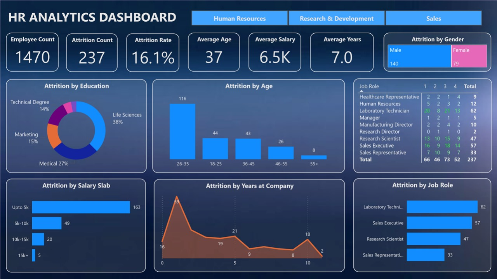

# 📊 HR Analytics Dashboard

An interactive Power BI dashboard visualizing employee attrition, job satisfaction, salary trends, and HR metrics across departments with clean, modern visuals.

---

## 📚 Table of Contents

- [🧠 Project Overview](#-project-overview)
- [📊 Insights Uncovered](#-insights-uncovered)
- [🛠 Tools & Technologies Used](#-tools--technologies-used)
- [📈 Use Case](#-use-case)
- [🎥 Live Demo](#-live-demo)

---

## 🧠 Project Overview

This dashboard transforms raw HR data into actionable insights. It allows users to explore attrition patterns, salary distribution, and job satisfaction across different departments, age groups, education levels, and genders — helping stakeholders make data-informed HR decisions.

---

## 📊 Insights Uncovered

- 🔹 Departments with the highest attrition rates  
- 🔹 Gender and education impact on attrition  
- 🔹 Salary slabs and age groups most affected  
- 🔹 Job roles with lowest satisfaction levels  
- 🔹 Tenure trends related to attrition

---

## 🛠 Tools & Technologies Used

- Power BI Desktop  
- DAX (Calculated Columns & Measures)  
- Excel/CSV (for data cleaning and transformation)  
- Dashboard design (alignment, theming, layout principles)

---

## 📈 Use Case

This dashboard supports HR managers and analysts in:
- Identifying problem areas in employee retention
- Evaluating satisfaction and compensation alignment
- Making informed decisions with interactive visuals

---

## 🎥 Live Demo

▶️ [Watch Dashboard Walkthrough](https://www.loom.com/share/6ccc1d41540d47eabc91166cd46d1add?sid=15fd5d9a-12b1-4c59-a02a-eca32e38d82b)  

---
